# Palworld Server Dashboard

A self-hosted web dashboard for operating **one or more** Palworld dedicated servers from a browser — through the Palworld REST API and RCON, plus a safe host-integration layer for the actions the REST API can't do (start/stop/restart, provisioning).

> A fork of [RNZ01/palworld-server-dashboard](https://github.com/RNZ01/palworld-server-dashboard) (MIT) with expanded operations: full server lifecycle, world/engine/PalDefender settings, mod management, native save inspection & editing, backups & scheduling, restart automation, and multi-server management.

## TL;DR — pick your install

### Quick Install

Run the prebuilt image in ~2 minutes — no build required.

<table>
<tr><th width="50%">✅ You get</th><th width="50%">⚠️ Limitations</th></tr>
<tr valign="top"><td>

- Live status, FPS, metrics
- Live map
- Roster (kick / ban)
- Saves & backups
- Save inspector & editor
- Mods
- World / Engine / PalDefender settings
- RCON console

</td><td>

- Item/Pal pickers show **raw IDs** by default (add real names + icons later, in-dashboard — see Full Install)
- Header connect address is a **placeholder**
- **Start / Stop / Restart + multi-server** buttons are inert (no host integration)

</td></tr>
</table>

**Already have a Palworld server?** Point the dashboard at it:

```bash
docker run -d -p 3000:3000 \
  -e PANEL_INITIAL_ADMIN_PASSWORD=change-me \
  -e PALWORLD_ADMIN_PASSWORD=your-palworld-admin-password \
  -e PALWORLD_REST_URL=http://host.docker.internal:8212 \
  ghcr.io/dhampyru/palworld-dashboard:latest
```

**No server yet?** One command brings up game server + dashboard together (create a `.env` with `PANEL_INITIAL_ADMIN_PASSWORD` + `PALWORLD_ADMIN_PASSWORD` first):

```bash
docker compose -f docker-compose.full.yml up -d
```

### Full Install

Wire up the host integration (and optionally build from source) to unlock everything the quick install leaves out.

<table>
<tr><th width="50%">✅ Adds</th><th width="50%">⚠️ Costs</th></tr>
<tr valign="top"><td>

- Everything in Quick Install, plus:
- Friendly item/Pal **names + icons** — added **in the dashboard** (upload a `mappings.usmap` + an icon zip), no rebuild
- Your **real connect address** in the header
- **Start / Stop / Restart + multi-server** (host integration)
- Optional: build & customize from source

</td><td>

- Install the **host integration** (also powers in-dashboard name extraction)
- Provide your own **licensed game files** (for names/icons — nothing is bundled)
- Longer initial setup

</td></tr>
</table>

Step-by-step: **[Full Self-Hosted Setup](content/getting-started/full-setup.mdx)**.

## Preview

Screenshots are from the built-in demo mode (`DEMO_MODE=1`), so all data shown is
mock sample data.

### Dashboard

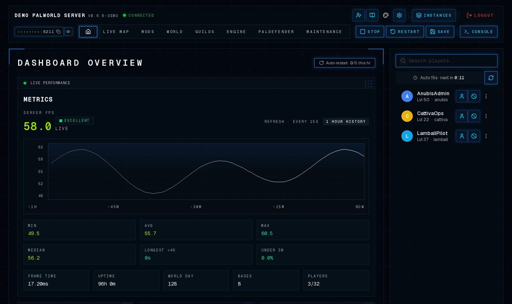

### Login

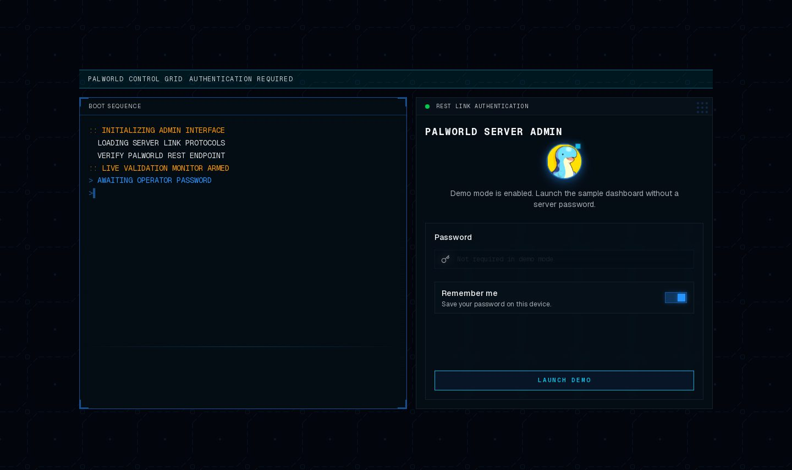

### Live Map

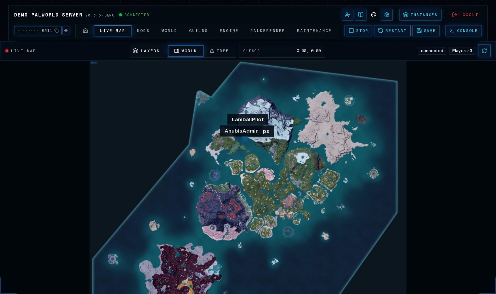

### More views

<table>
  <tr>
    <td width="50%" valign="top"><a href="public/readme/mods-preview.jpg">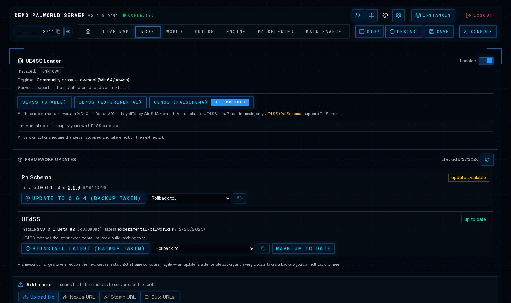</a><br><sub><b>Mods</b> — install pak, UE4SS &amp; PalSchema mods, with framework (UE4SS/PalSchema) update detection &amp; saved loadout profiles</sub></td>
    <td width="50%" valign="top"><a href="public/readme/world-settings-preview.jpg">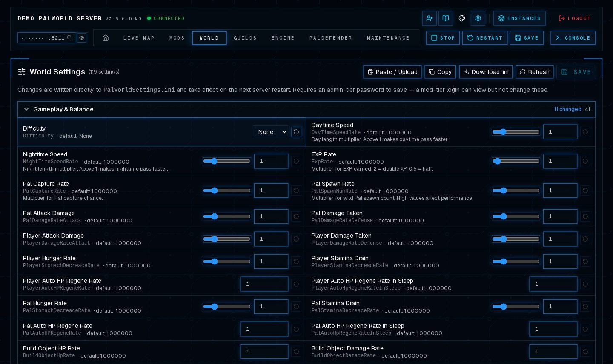</a><br><sub><b>World Settings</b> — editor with performance presets</sub></td>
  </tr>
  <tr>
    <td width="50%" valign="top"><a href="public/readme/engine-preview.jpg">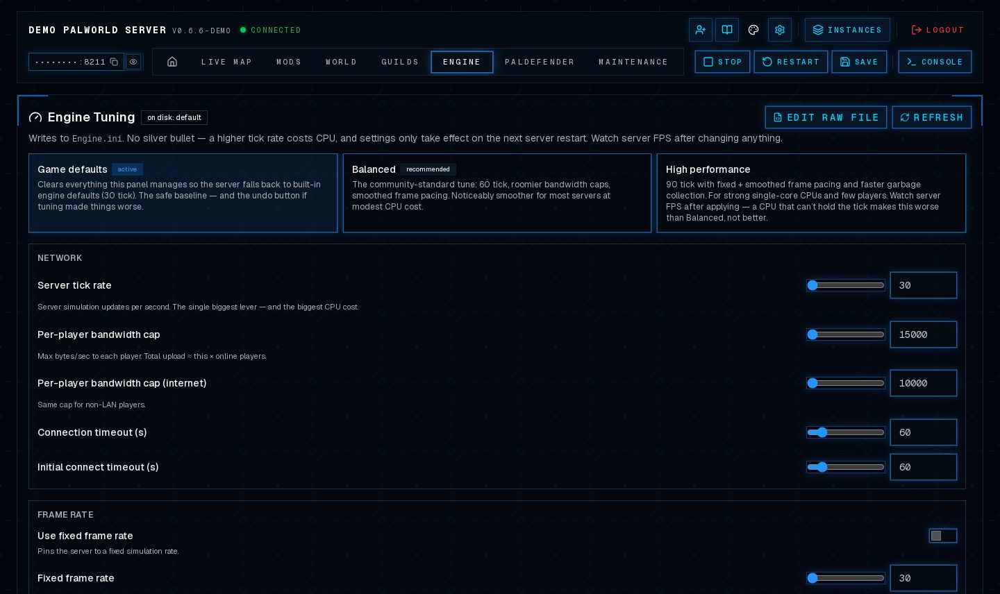</a><br><sub><b>Engine</b> — Engine.ini tuning &amp; launch flags</sub></td>
    <td width="50%" valign="top"><a href="public/readme/paldefender-preview.jpg">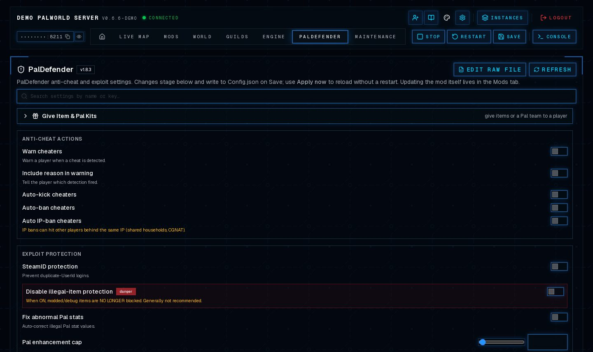</a><br><sub><b>PalDefender</b> — mod configuration</sub></td>
  </tr>
  <tr>
    <td width="50%" valign="top"><a href="public/readme/guilds-preview.jpg">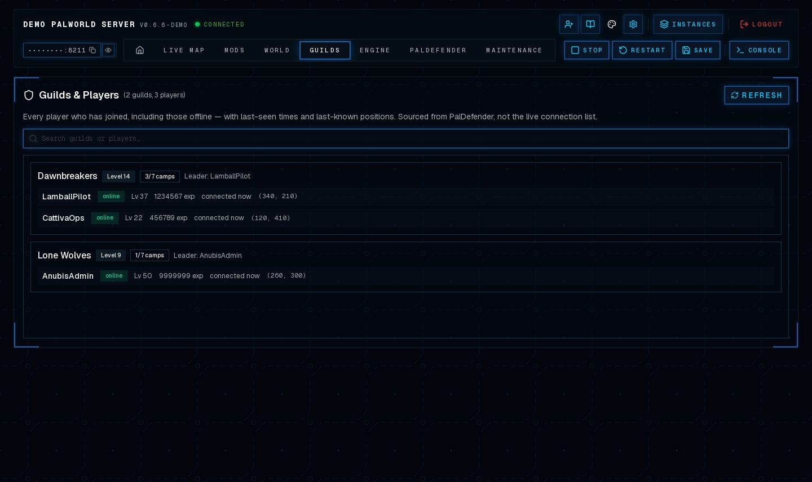</a><br><sub><b>Guilds &amp; Players</b> — everyone who has ever joined</sub></td>
    <td width="50%" valign="top"><a href="public/readme/saves-preview.jpg">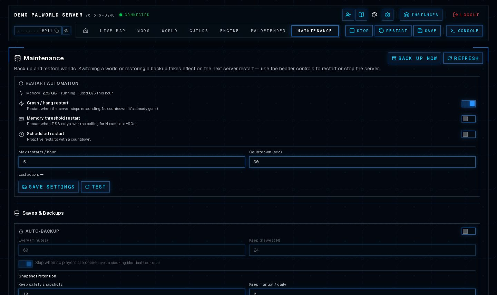</a><br><sub><b>Maintenance</b> — saves, backups &amp; auto-backup</sub></td>
  </tr>
  <tr>
    <td width="50%" valign="top"><a href="public/readme/save-inspector-preview.jpg">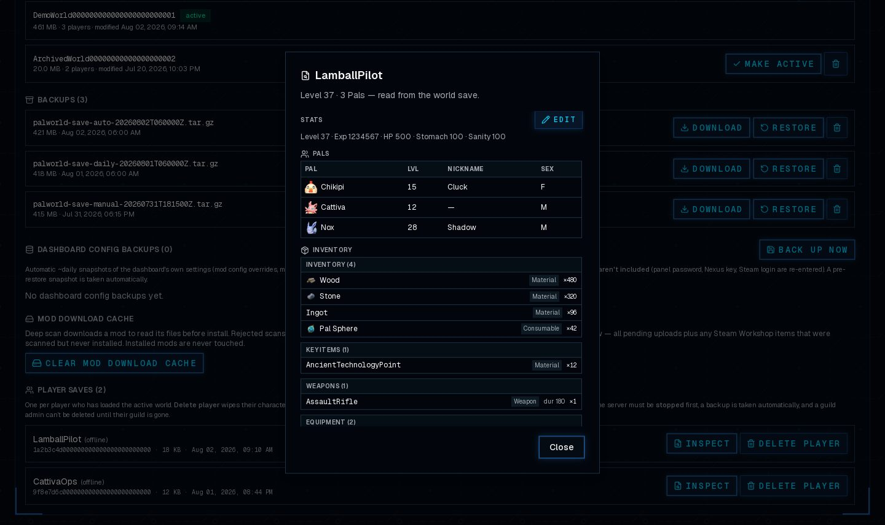</a><br><sub><b>Save Inspector</b> — native Pal/item/stat editing</sub></td>
    <td width="50%" valign="top"><a href="public/readme/rcon-console-preview.jpg">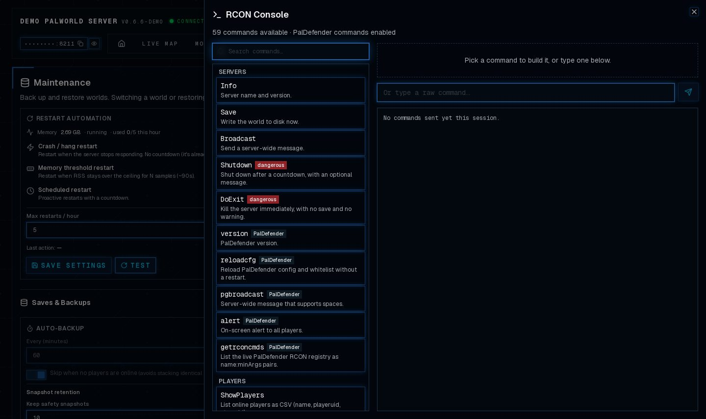</a><br><sub><b>RCON Console</b> — command registry &amp; forms</sub></td>
  </tr>
  <tr>
    <td width="50%" valign="top"><a href="public/readme/fleet-preview.jpg">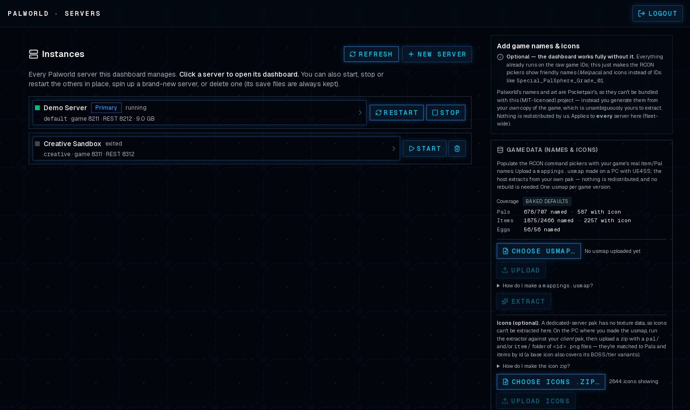</a><br><sub><b>Fleet</b> — manage multiple servers</sub></td>
    <td width="50%" valign="top"></td>
  </tr>
</table>

## Features

**Monitoring & players**
- Live status, uptime, FPS (rolling server-side history), frame time, player count, world metrics
- Online roster with kick / ban / unban; live map with player positions + markers
- Live chat and admin announcements

**Server operations**
- Start / stop / restart via a safe host-integration pattern (no sudo or Docker socket in the web tier)
- RCON console; World settings with performance presets; `Engine.ini` tuning; PalDefender config
- Mods: install / remove pak, UE4SS, and PalSchema mods; install from Steam Workshop and Nexus
- Client mod loadouts for friends (shareable bundles) with a keybind manager — conflict detection, one-click remap, saved profiles, and an auto-generated controls cheat-sheet
- Saves & backups: browse worlds, manual + scheduled auto-backups, restore, per-player saves, and a native save inspector/editor (Pals, items, stats)
- Restart automation: scheduled / memory / crash triggers with an hourly cap

**Multiple servers**
- A fleet view to create, start/stop/restart, and delete (keeping saves) multiple servers — each server's whole dashboard scoped to it

**Access & platform**
- Admin and limited moderator access tiers; demo mode
- Docker Compose deployment with an FPS-sampler sidecar
- Built-in documentation (Nextra), served at `/docs`

## Quick Start

### Docker Compose

```bash
cp .env.example .env
# edit .env — see Required Configuration below

docker compose build      # this fork's features build from source
docker compose up -d
```

Open:

```text
http://localhost:3000
```

### Prebuilt image (GHCR)

Prefer not to build? Pull the published **clean** image (built by CI with no
bundled game data — see the caveats below):

```bash
docker pull ghcr.io/dhampyru/palworld-dashboard:latest
```

Minimal run, pointed at your Palworld REST API:

```bash
docker run -d -p 3000:3000 \
  -e PANEL_INITIAL_ADMIN_PASSWORD=change-me \
  -e PALWORLD_ADMIN_PASSWORD=your-real-palworld-admin-password \
  -e PALWORLD_REST_URL=http://host.docker.internal:8212 \
  ghcr.io/dhampyru/palworld-dashboard:latest
```

Caveats for the prebuilt image:

- **Pickers/save inspector show raw IDs** (not names) — the image ships no Palworld
  game data. Add names + icons **in-dashboard**, no rebuild (Game Data card: upload a
  `mappings.usmap` + an icon zip; name extraction uses the host integration, icon
  upload doesn't) — see [Item & Pal Datasets](content/configuration/item-pal-datasets.mdx).
  A source build is only one alternative.
- **Connect address is a placeholder** in the header/Invite — `NEXT_PUBLIC_GAME_SERVER_IP`
  is baked at build time, so showing your real address means building from source
  (players can still connect via your real IP regardless).
- **Lifecycle buttons + provisioning need [host integration](content/deployment/host-integration.mdx)**;
  monitoring, saves, mods, and settings work without it.

### Local Development

```bash
npm install
cp .env.example .env
npm run dev
```

Open:

```text
http://localhost:3000
```

## Required Configuration

At minimum, configure:

```env
PANEL_INITIAL_ADMIN_PASSWORD=replace-with-a-panel-password
PALWORLD_ADMIN_PASSWORD=replace-with-real-palworld-admin-password
PALWORLD_REST_URL=http://127.0.0.1:8212
```

For Docker, if Palworld runs on the host machine, use:

```env
PALWORLD_REST_URL=http://host.docker.internal:8212
```

See the full configuration guide: [content/configuration/environment-variables.mdx](content/configuration/environment-variables.mdx),
and host sizing / ports in [Requirements](content/getting-started/requirements.mdx).

## Server control & multiple servers (host integration)

The Start / Stop / Restart controls and the multi-server "New server" wizard perform
**privileged actions** (`docker compose`, provisioning) that the web container deliberately
**cannot** do itself. They work by writing a request file that a small **root-owned host
process consumes** — so the dashboard never needs sudo or the Docker socket.

This host integration must be installed for those controls to *act* (everything else —
monitoring, saves, mods, settings — works without it). Versioned host scripts ship under
[`scripts/host/`](scripts/host). Setup:

- **Host integration:** [content/deployment/host-integration.mdx](content/deployment/host-integration.mdx)
- **Running multiple servers:** [content/features/multi-server.mdx](content/features/multi-server.mdx)

## Scripts

```bash
npm run dev        # start development server
npm run build      # production build + docs search index
npm run start      # start production server
npm run typecheck  # route typegen + TypeScript check
npm run check      # typecheck + build
```

## Security Notice

This is an admin tool for a game server. Do not expose it publicly without additional
protection such as VPN, reverse-proxy authentication, SSO, or IP allowlisting.

The browser logs in with a panel password. The real Palworld REST admin password is kept
server-side and injected only by the dashboard proxy. Per-server admin passwords for
provisioned instances are generated and stored host-side, never in the browser or the repo.

Read the security guide before production use: [content/security.mdx](content/security.mdx).

## Documentation

Full documentation is built into the app and served at `/docs` when it's running (source
under [`content/`](content)): installation, configuration, authentication, moderator
access, deployment, host integration, multiple servers, operations, troubleshooting, and
development.

Optional: to give the RCON `give` / `givepal` / `giveegg` pickers friendly names and
icons, populate the datasets from your own game — see
[Item & Pal Datasets](content/configuration/item-pal-datasets.mdx).

## Support

This project is free and open source, and always will be. If it's useful to you,
you can support ongoing maintenance and new features via
[GitHub Sponsors](https://github.com/sponsors/Dhampyru). Sponsorship funds the
work — it never gates features or paywalls the software; every feature stays
available to everyone, self-hosted.

## Acknowledgments

- **[palworld-save-pal](https://github.com/oMaN-Rod/palworld-save-pal)** by oMaN-Rod (MIT) — powers the native save inspection & editing. Its `psp-core` — with the pure-Rust [ooz-rs](https://github.com/palworld-save-pal/ooz-rs) Kraken/Oodle decoder and [uesave-rs](https://github.com/oMaN-Rod/uesave-rs) — is what lets the dashboard read and edit Palworld's `PlM1`/Oodle saves with no proprietary dependencies. Full attribution in [`savtools/NOTICE`](savtools/NOTICE).
- **[RNZ01/palworld-server-dashboard](https://github.com/RNZ01/palworld-server-dashboard)** (MIT) — the upstream project this is forked from.
- Works alongside **[UE4SS](https://github.com/UE4SS-RE/RE-UE4SS)** and **PalDefender**; picker datasets are generated with **[FModel](https://fmodel.app/)** (see the [Item & Pal Datasets](content/configuration/item-pal-datasets.mdx) guide).

## License

MIT. See [LICENSE](./LICENSE). This project is a fork of
[RNZ01/palworld-server-dashboard](https://github.com/RNZ01/palworld-server-dashboard);
upstream copyright and license are retained.
