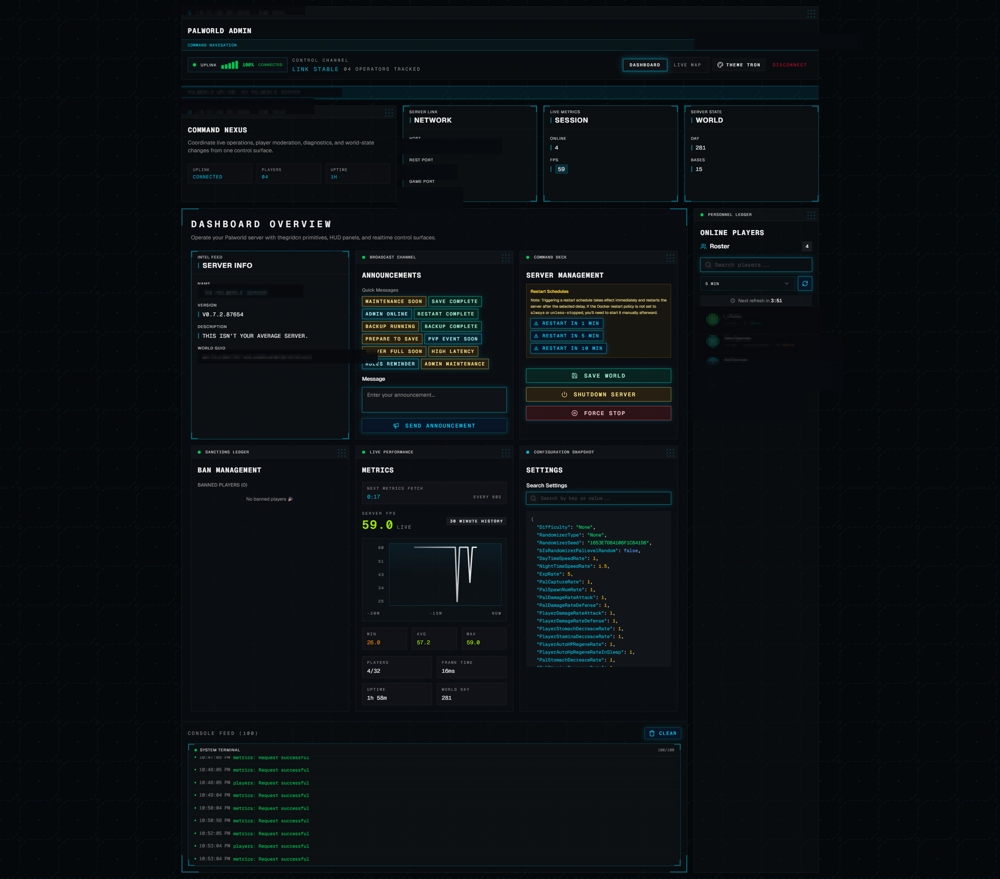
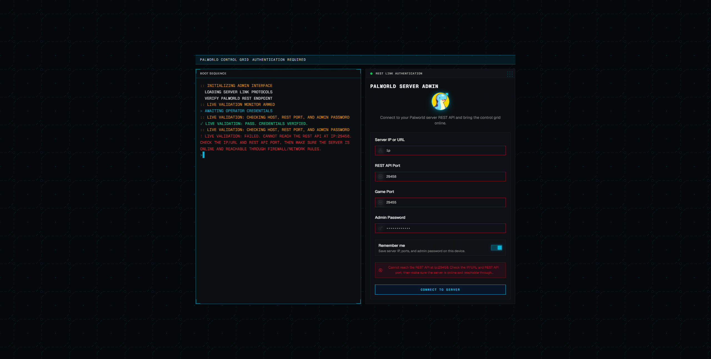
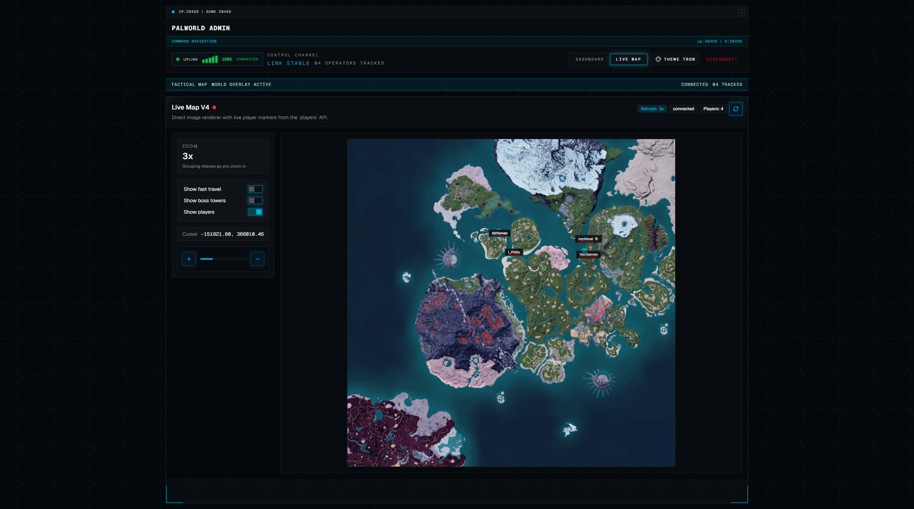

# Palworld Server Dashboard

A self-hosted web dashboard for operating **one or more** Palworld dedicated servers from a browser — through the Palworld REST API and RCON, plus a safe host-integration layer for the actions the REST API can't do (start/stop/restart, provisioning).

> A fork of [RNZ01/palworld-server-dashboard](https://github.com/RNZ01/palworld-server-dashboard) (MIT) with expanded operations: full server lifecycle, world/engine/PalDefender settings, mod management, native save inspection & editing, backups & scheduling, restart automation, and multi-server management.

## Preview

Sensitive data in the dashboard screenshot below has been blurred.

### Dashboard



### Login



### Live Map



## Features

**Monitoring & players**
- Live status, uptime, FPS (rolling server-side history), frame time, player count, world metrics
- Online roster with kick / ban / unban; live map with player positions + markers
- Live chat and admin announcements

**Server operations**
- Start / stop / restart via a safe host-integration pattern (no sudo or Docker socket in the web tier)
- RCON console; World settings with performance presets; `Engine.ini` tuning; PalDefender config
- Mods: install / remove pak, UE4SS, and PalSchema mods; install from Steam Workshop and Nexus
- Saves & backups: browse worlds, manual + scheduled auto-backups, restore, per-player saves, and a native save inspector/editor (Pals, items, stats)
- Restart automation: scheduled / memory / crash triggers with an hourly cap

**Multiple servers**
- A fleet view to create, start/stop/restart, and delete (keeping saves) multiple servers — each server's whole dashboard scoped to it

**Access & platform**
- Admin and limited moderator access tiers; demo mode
- Docker Compose deployment with an FPS-sampler sidecar
- Built-in documentation (Nextra), served at `/docs`

## Quick Start

### Docker Compose

```bash
cp .env.example .env
# edit .env — see Required Configuration below

docker compose build      # this fork's features build from source
docker compose up -d
```

Open:

```text
http://localhost:3000
```

### Local Development

```bash
npm install
cp .env.example .env
npm run dev
```

Open:

```text
http://localhost:3000
```

## Required Configuration

At minimum, configure:

```env
PANEL_INITIAL_ADMIN_PASSWORD=replace-with-a-panel-password
PALWORLD_ADMIN_PASSWORD=replace-with-real-palworld-admin-password
PALWORLD_REST_URL=http://127.0.0.1:8212
```

For Docker, if Palworld runs on the host machine, use:

```env
PALWORLD_REST_URL=http://host.docker.internal:8212
```

See the full configuration guide: [content/configuration/environment-variables.mdx](content/configuration/environment-variables.mdx),
and host sizing / ports in [Requirements](content/getting-started/requirements.mdx).

## Server control & multiple servers (host integration)

The Start / Stop / Restart controls and the multi-server "New server" wizard perform
**privileged actions** (`docker compose`, provisioning) that the web container deliberately
**cannot** do itself. They work by writing a request file that a small **root-owned host
process consumes** — so the dashboard never needs sudo or the Docker socket.

This host integration must be installed for those controls to *act* (everything else —
monitoring, saves, mods, settings — works without it). Versioned host scripts ship under
[`scripts/host/`](scripts/host). Setup:

- **Host integration:** [content/deployment/host-integration.mdx](content/deployment/host-integration.mdx)
- **Running multiple servers:** [content/features/multi-server.mdx](content/features/multi-server.mdx)

## Scripts

```bash
npm run dev        # start development server
npm run build      # production build + docs search index
npm run start      # start production server
npm run typecheck  # route typegen + TypeScript check
npm run check      # typecheck + build
```

## Security Notice

This is an admin tool for a game server. Do not expose it publicly without additional
protection such as VPN, reverse-proxy authentication, SSO, or IP allowlisting.

The browser logs in with a panel password. The real Palworld REST admin password is kept
server-side and injected only by the dashboard proxy. Per-server admin passwords for
provisioned instances are generated and stored host-side, never in the browser or the repo.

Read the security guide before production use: [content/security.mdx](content/security.mdx).

## Documentation

Full documentation is built into the app and served at `/docs` when it's running (source
under [`content/`](content)): installation, configuration, authentication, moderator
access, deployment, host integration, multiple servers, operations, troubleshooting, and
development.

Optional: to give the RCON `give` / `givepal` / `giveegg` pickers friendly names and
icons, populate the datasets from your own game — see
[Item & Pal Datasets](content/configuration/item-pal-datasets.mdx).

## Support

This project is free and open source, and always will be. If it's useful to you,
you can support ongoing maintenance and new features via
[GitHub Sponsors](https://github.com/sponsors/Dhampyru). Sponsorship funds the
work — it never gates features or paywalls the software; every feature stays
available to everyone, self-hosted.

## License

MIT. See [LICENSE](./LICENSE). This project is a fork of
[RNZ01/palworld-server-dashboard](https://github.com/RNZ01/palworld-server-dashboard);
upstream copyright and license are retained.
